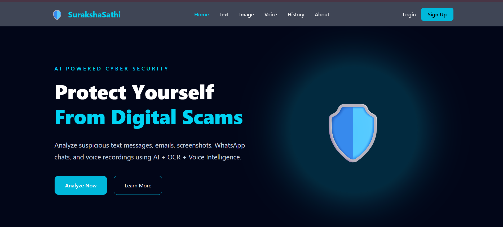
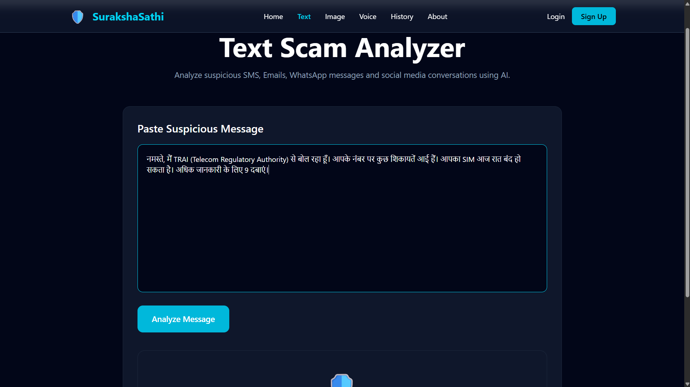
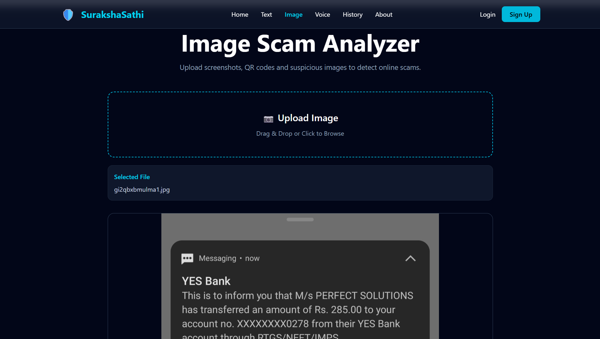
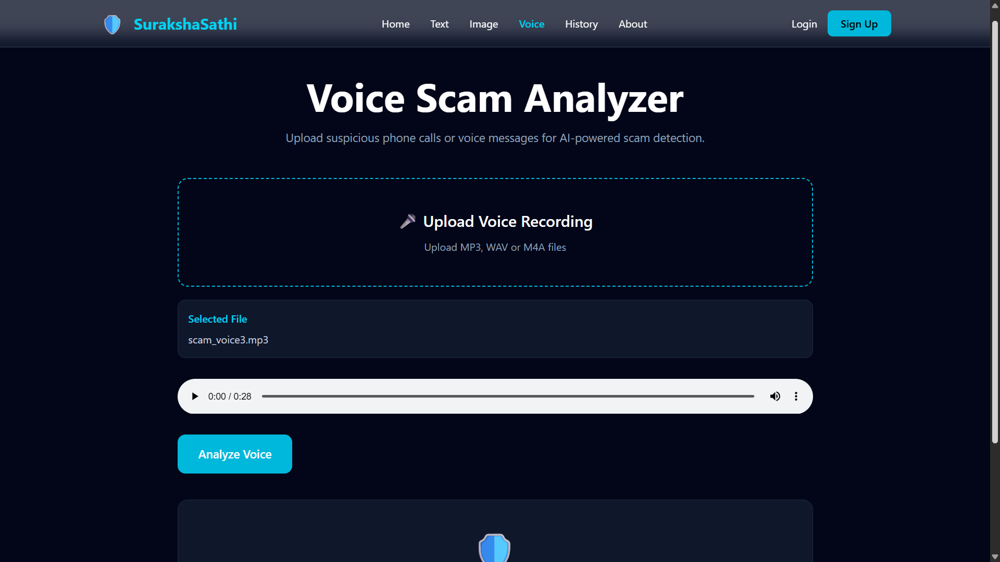
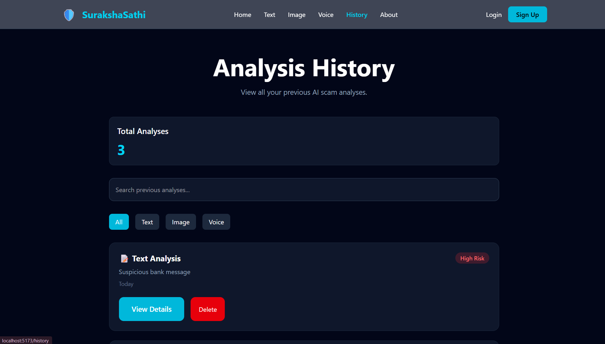

<div align="center">

# 🛡️ SurakshaSathi AI

### AI-Powered Cyber Scam Detection Platform

Detect suspicious Text Messages, Images, QR Codes, Voice Calls and URLs using Artificial Intelligence.

---


🚀 AI • Cybersecurity • Scam Detection • Digital Safety

</div>

---

# 📌 Overview

SurakshaSathi AI is an intelligent cybersecurity platform that helps users identify online scams before they become victims.

The application analyzes multiple types of digital content using Artificial Intelligence and provides:

- 📊 Scam Probability Score
- 🚩 Risk Indicators
- 💡 AI Generated Explanation
- ✅ Safety Recommendations
- 🔊 Voice Response
- 📜 Analysis History

The goal is to improve digital awareness and protect users from modern cyber frauds.

---

# ✨ Features

## 📝 Text Analysis

- Scam message detection
- AI explanation
- Risk score
- Red flag identification
- Prevention tips

---

## 🖼 Image Analysis

- Screenshot scam detection
- Fake payment screenshot detection
- QR image understanding
- OCR based analysis
- AI explanation

---

## 🎤 Voice Analysis

- Speech-to-text conversion
- Voice scam detection
- AI generated explanation
- Risk score
- Spoken response (Text-to-Speech)

---

## 🔗 URL Analysis

- Phishing website detection
- Fraudulent link analysis
- Domain safety evaluation
- AI explanation

---

## 📱 QR Analysis

- QR decoding
- Suspicious QR detection
- Destination analysis
- AI generated recommendations

---

## 👤 Authentication

- User Signup
- Login
- JWT Authentication
- Protected Routes

---

## 📜 History

- Save previous analyses
- Review results anytime
- User-specific history

---

## 📤 Share Result

- Share analysis with friends or family
- Copy report
- Download report

---

# 🧠 AI Capabilities

SurakshaSathi uses Google's Gemini AI for intelligent scam detection.

The AI analyzes

- Language patterns
- Emotional manipulation
- Urgency
- Financial threats
- Fraud indicators
- Image context
- Voice transcripts
- URLs
- QR contents

and produces

- Risk Percentage
- Explanation
- Red Flags
- Safety Recommendations

---

# 🏗 System Architecture

```
User
   │
   ▼
React Frontend
   │
REST APIs
   │
FastAPI Backend
   │
AI Service Layer
   │
Gemini AI
   │
MongoDB Database
```

---

# 🛠 Tech Stack

## Frontend

- React.js
- React Router
- Tailwind CSS
- Axios
- React Icons

## Backend

- FastAPI
- Python
- Pydantic
- JWT Authentication
- Uvicorn

## Artificial Intelligence

- Google Gemini AI
- OCR
- Speech Recognition
- Text-to-Speech

## Database

- MongoDB

## Other Tools

- Git
- GitHub
- VS Code
- Postman

---

# 📷 Screenshots

## Home Page



---

## Text Analysis



---

## Image Analysis



---

## Voice Analysis



---


---


---

## History



---

# 🎥 Demo

📺 YouTube Demo

(Add Link)

---

# ⚙ Installation

Clone the repository

```bash
git clone https://github.com/yourusername/SurakshaSathi-AI.git
```

Frontend

```bash
cd frontend
npm install
npm run dev
```

Backend

```bash
cd backend

python -m venv venv

venv\Scripts\activate

pip install -r requirements.txt

uvicorn app.main:app --reload
```

---

# 📂 Project Structure

```
SurakshaSathi-AI

frontend/
│
├── components/
├── pages/
├── services/
├── hooks/

backend/
│
├── routers/
├── routes/
├── services/
├── providers/
├── models/
├── database/
├── schemas/

README.md
```

---

# 🚀 Future Improvements

- Mobile Application
- Email Scam Detection
- WhatsApp Integration
- Browser Extension
- Live Website Monitoring
- Multi-language Support
- Admin Dashboard
- PDF Report Generation

---

# 👨‍💻 Team

Developed by a team of five engineering students.

- Frontend Development
- Backend Development
- AI Integration
- Machine Learning
- UI/UX & Testing

---

# ⭐ If you like this project

Please consider giving this repository a ⭐ on GitHub.

---

# 📄 License

This project is developed for educational and research purposes.